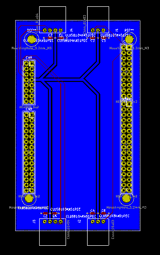

Husky A100 Nucleo Shield
===

## Circuit

This board is for my MQP (Major Qualifying Project) to develop a autonomous robotic platform to compete in the Intelligent Ground Vehicle Competition. The purpose of this board is to provide a secure connection between the STM32F7 Nucleo microcontroller board, the Talon motor controllers (PWM) and the US Digital quadrature encoders. It breaks out power and I/O to all the connectors.

## PCB Layout

